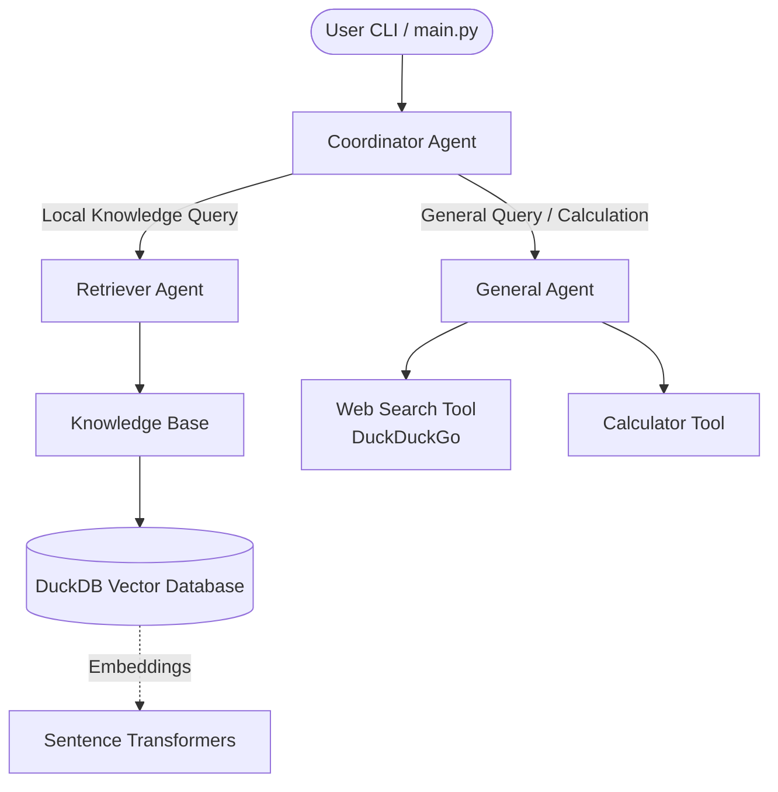

# AI Research Assistant

## Project Overview
This project is an AI-powered Research Assistant that processes user queries via a command-line interface. It uses a routing architecture where a Coordinator Agent decides whether to answer a query using local, domain-specific knowledge (via a Retriever Agent and a local vector database) or using general knowledge, web searches, and calculations (via a General Agent).

## Architecture Diagram

## Design Decisions
* **Framework Choice:** Built using the `agno` library to construct the agentic workflows, teams, and knowledge bases.
* **Model Provider:** Uses `openai/gpt-oss-120b:free` via the OpenRouter API to power the LLM agents.
* **Routing Pattern:** Employs a `Team` in `TeamMode.route` as a Coordinator Agent to explicitly delegate requests to either specialized local retrieval or general web search.
* **Local Vector Database:** Custom implementation of `DuckDbVectorDb` to store and query embeddings locally using DuckDB, avoiding reliance on external vector database services.
* **Local Embeddings:** Uses the `SentenceTransformerEmbedder` (`all-MiniLM-L6-v2`) to compute text embeddings locally without incurring API costs.
* **State Tracking:** Uses global variables (like `last_retrieved_docs` in `agents.py`) to pass retrieval metadata back to the main loop for display.

## Tradeoffs
* **Scalability Limitations:** DuckDB is an embedded database, which works great for local scripts but might lack the concurrency and scalability of dedicated vector databases (e.g., Qdrant, Pinecone) in a production web environment.
* **Coupling and Global State:** `main.py` tightly couples with `agents.py` by accessing and clearing global state (`agents.last_retrieved_docs`) directly, which is not thread-safe and prevents parallel query handling.
* **Free Tier Reliance:** The application is hardcoded to use a free model on OpenRouter (`openai/gpt-oss-120b:free`), which may lead to rate limiting, latency, or unpredictable reliability compared to a paid tier.
* **Missing Automated Tests:** There is no explicitly defined test suite (like `pytest` tests) visible for the core components, though an `evaluate.py` script exists for what appears to be manual or batch evaluation.
* **Unused/Parallel Workflows:** There is a `workflow.py` file implementing an explicit fallback condition (retriever failing over to general agent), but `main.py` bypasses this and uses the `coordinator_agent` directly, indicating potential fragmented logic or an incomplete migration.
